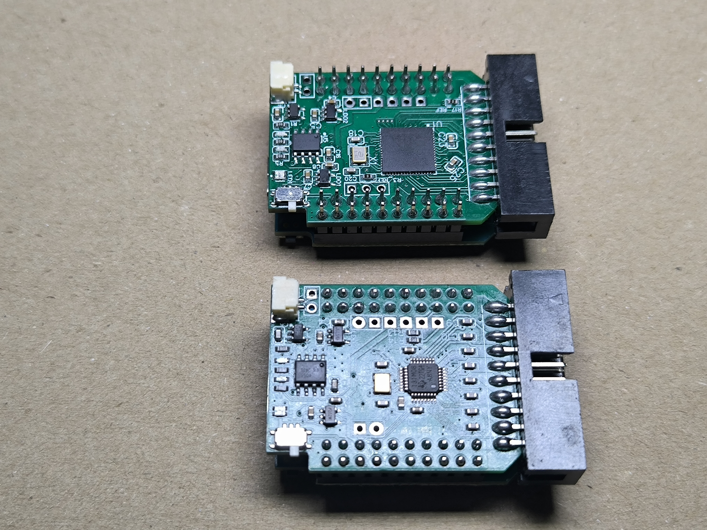
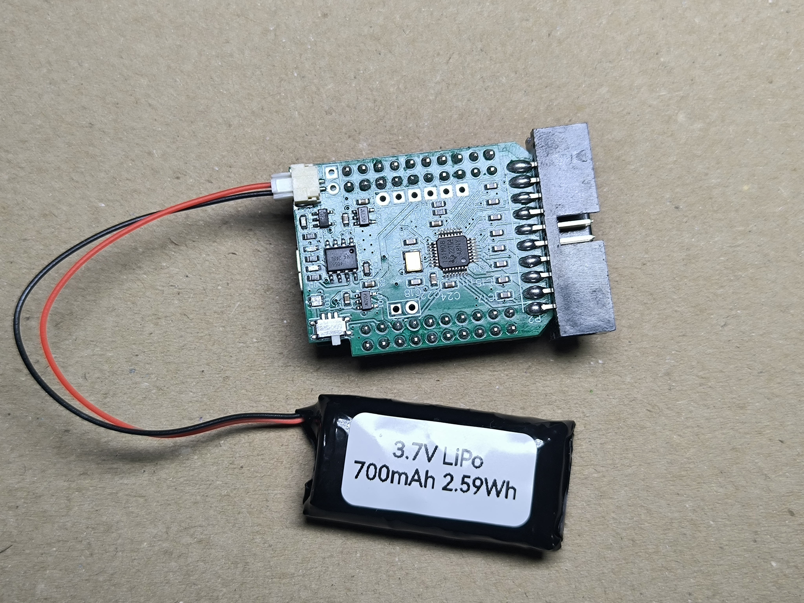
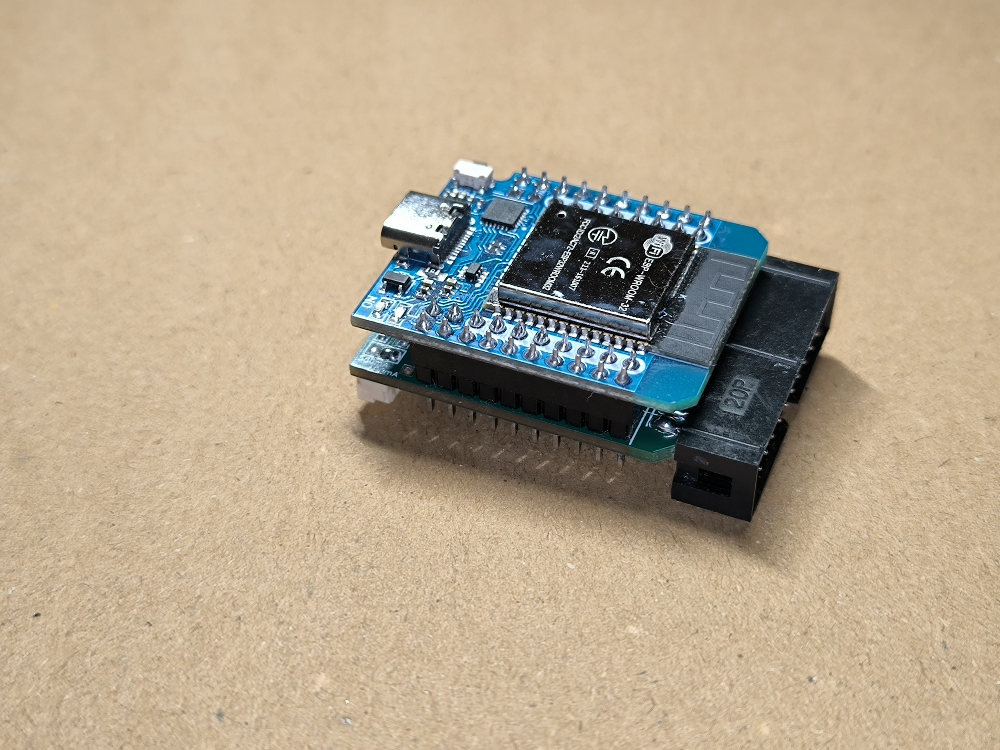
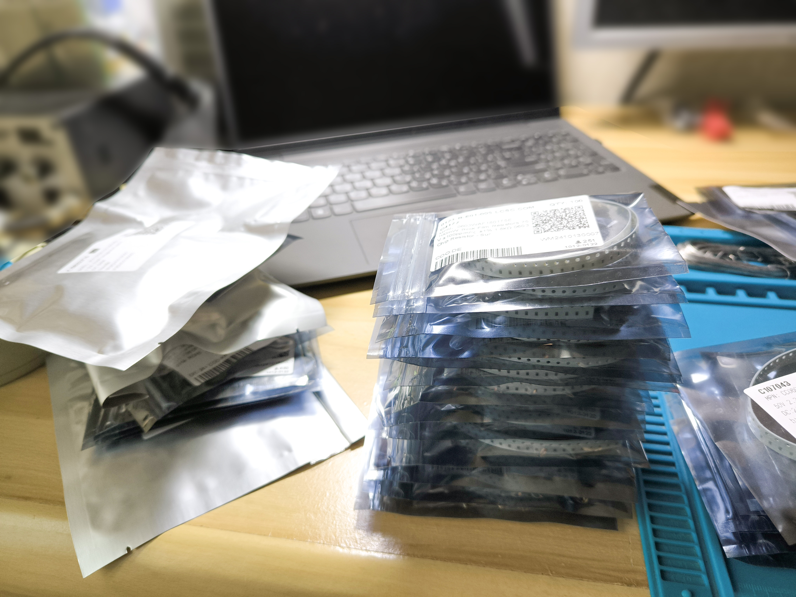
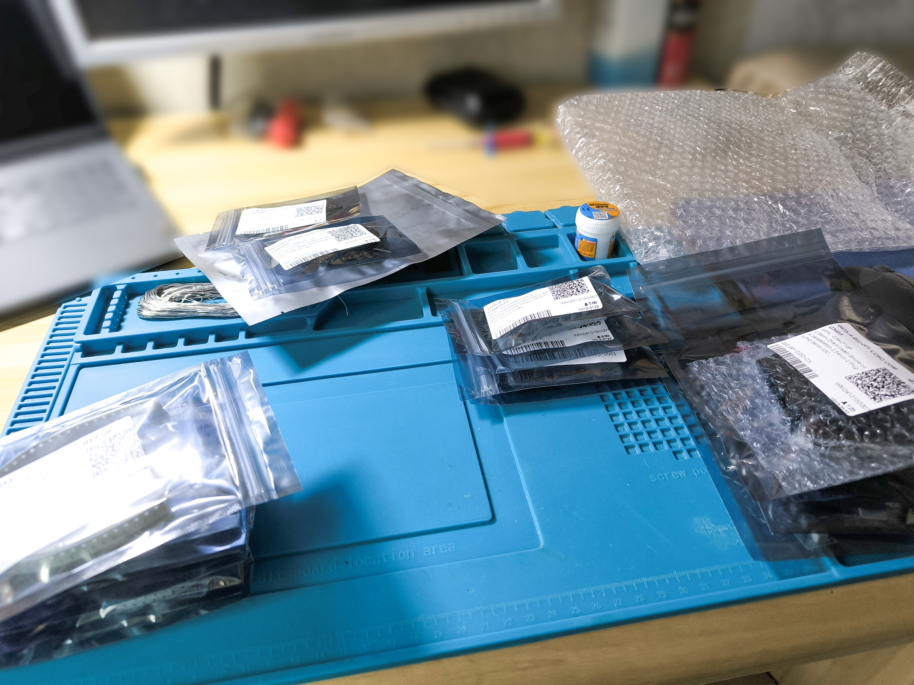
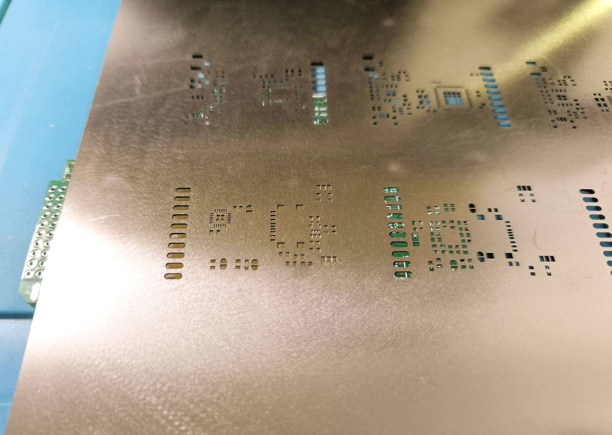
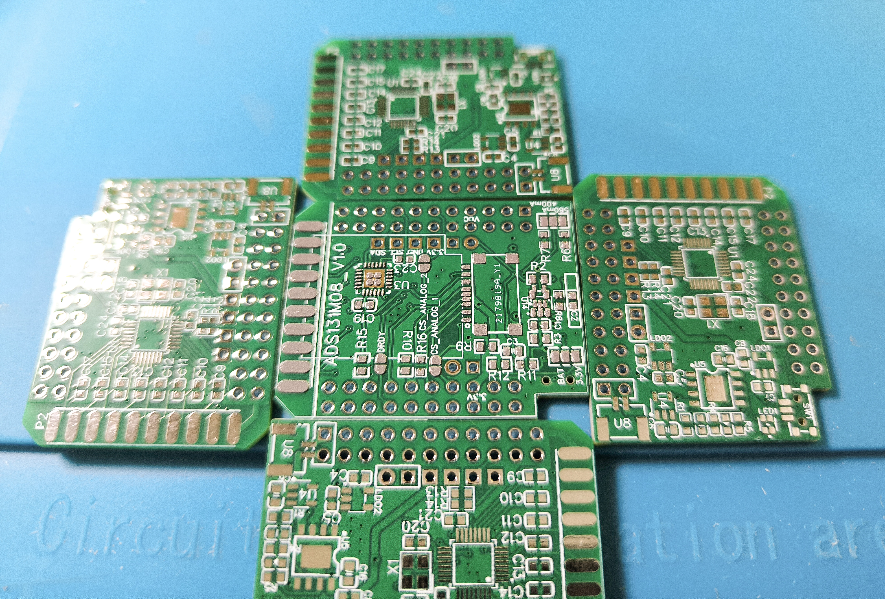
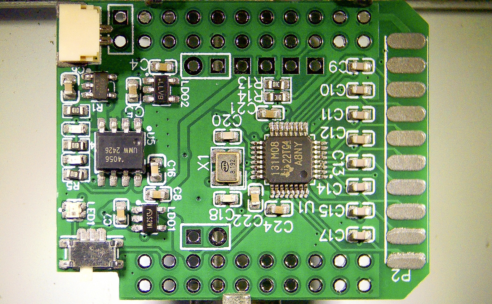
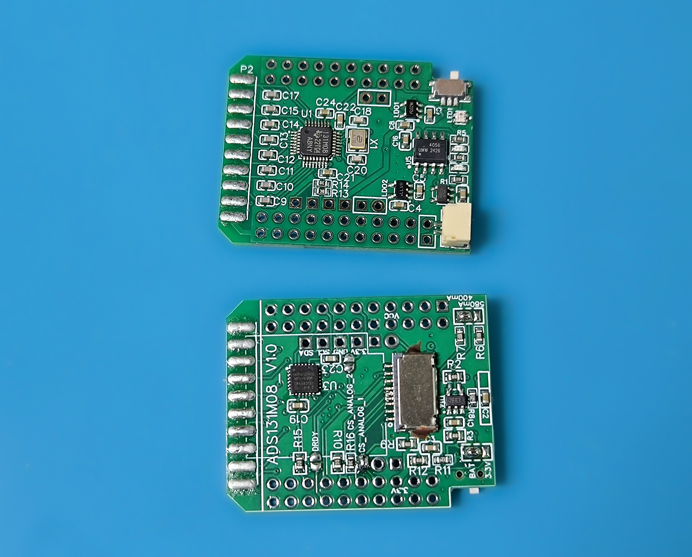

# BioListener Hardware

This repository contains all the necessary files related to the **BioListener project** hardware design, including **PCB source files**, **schematic files**, **fabrication files**, **BOM files**, and  **interactive BOM files**. The hardware designs are created in [EasyEDA](https://easyeda.com/), ensuring easy access and modification for further development.

## Evaluated Boards
The following boards are evaluated and tested as part of the BioListener project:

- **ADC AD7771** (Analog Devices)
- **ADC ADS131M08** (Texas Instruments)

## Included PCBs
- [**BioListener ADC AD7771-based Board v1.0**](hardware/pcb/AD7771_V1.0) - 4 layer PCB
- [**BioListener ADC ADS131M08-based Board v1.0**](hardware/pcb/ADS131M08_V1.0) - 4 layer PCB

See shematic in the PCBs folders as PDF documents.

## Included PCB Drafts
- **BioListener Stimulation Board v1.0** (Draft) - 4 layer PCB

### BioListener Boards v1.0

#### Ready PCBs (Prototypes)

  

  

  

#### Manual Assembly Process

| Step                                                      | Image                                                                                                                                                                       |
|-----------------------------------------------------------|-----------------------------------------------------------------------------------------------------------------------------------------------------------------------------|
| **1. Components**                                         |   |
| **2. Stencil,  Solder Paste applied**                  |               |
| **3. Populating Under Microscope,  Hot Air Soldering** |                                                                                          |
| **5. SMD Components Soldered**                            |                                                                                             |
| **6. THD Connectors Soldered,  Boards Are Ready**      |                                                                                |

## License

This repository uses the following licenses:
- **Hardware design files** - The hardware design files in this repository are licensed under the **CERN Open Hardware Licence, Version 2 - Strongly Reciprocal**.  
